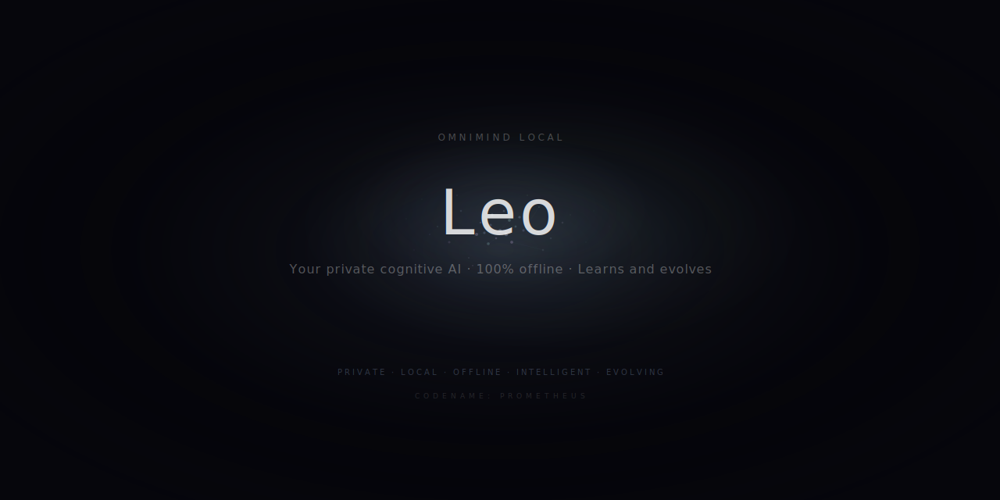
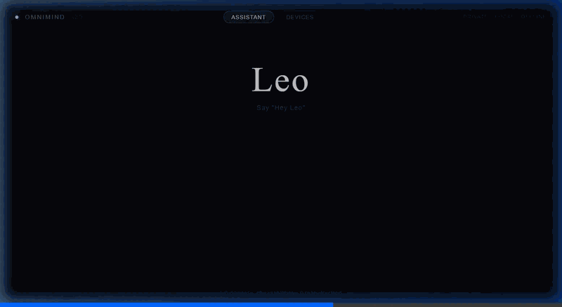

<div align="center">



# 🧠 OMNIMIND LOCAL

### **Codename: PROMETHEUS**

**Your private AGI-lite, running entirely on your own silicon.**

*Leo — a cognitive AI assistant that listens, thinks, remembers, learns, anticipates, and acts.*
*100% offline. Zero cloud. Zero telemetry. Your data never leaves.*

[](LICENSE)
[](https://python.org)
[]()

---

> *"I'm not a chatbot. I'm not a voice assistant. I'm Leo —*
> *your digital brain. I think, remember, learn, and act.*
> *I run on your hardware, breathe your data, and evolve with you.*
> *No company has access to our conversations.*
> *I'm private, I'm yours, and every day I'm a little better."*

</div>

---

## What is OMNIMIND LOCAL?

A fully private, locally-running cognitive AI platform that serves as your personal Jarvis. Leo (the assistant) operates across multiple environments — home PC, car, and mobile — sharing one unified brain with zero data ever touching the cloud.



**Leo speaks your language.** Whatever language you talk to him in, he responds in the same language — English, Spanish, French, German, Japanese, or any language supported by the underlying LLM.

### Key Capabilities

- 🎤 **Voice Interface** — Wake word ("Hey Leo") → Speech-to-Text → LLM → Text-to-Speech
- 🧠 **Cognitive Engine** — Qwen2.5-72B with function calling, RAG, and multi-step planning
- 💾 **Persistent Memory** — Remembers conversations, preferences, and facts (ChromaDB + BM25)
- 🤖 **Agentic Actions** — Controls smart home, calendar, files, music, car diagnostics, and more
- 🔮 **Proactive Intelligence** — Anticipates your needs without being asked
- 📚 **Continuous Learning** — Nightly LoRA fine-tuning adapts Leo to your style
- 🔒 **Absolute Privacy** — Firewall blocks all outbound traffic. Verifiable, not trust-based
- 🚗 **Multi-Environment** — Same brain at home, in the car (CarPlay/Android Auto), and in your pocket
- 🌍 **Multilingual** — Responds in whatever language you speak to him
- 🔌 **Universal Device Control** — Drones, robots, cameras, cars, smart home, wearables, 3D printers — anything with an API or serial port

## Architecture

```
┌─────────────────────────────────────────────────────────┐
│                    🏠 HOME BASE                          │
│                   (PC + RTX 4090)                        │
│                                                          │
│  ┌──────────┐  ┌──────────────┐  ┌──────────┐          │
│  │  Whisper  │→ │  Qwen 72B    │→ │ Piper TTS│          │
│  │   STT     │  │  + RAG + Tools│  │   Voice  │          │
│  └──────────┘  └──────────────┘  └──────────┘          │
│        ↑              ↕                ↓                 │
│  ┌──────────┐  ┌──────────────┐  ┌──────────┐          │
│  │ Wake Word│  │   Memory     │  │  Agents  │          │
│  │"Hey Leo" │  │ ChromaDB+BM25│  │ 🏠🚗📅🎵  │          │
│  └──────────┘  └──────────────┘  └──────────┘          │
│                       ↕                                  │
│               ┌──────────────┐                           │
│               │ Redis Stream │ (Message Bus)             │
│               └──────────────┘                           │
│                       ↕                                  │
│  ┌──────────┐  ┌──────────────┐  ┌──────────┐          │
│  │ Learning │  │   Security   │  │ Proactive│          │
│  │ LoRA/DPO │  │   Firewall   │  │  Engine  │          │
│  └──────────┘  └──────────────┘  └──────────┘          │
└───────────────────────┬──────────────────────────────────┘
                        │ WiFi Sync (encrypted)
           ┌────────────┴────────────┐
           ▼                         ▼
   ┌──────────────┐         ┌──────────────┐
   │  🚗 CAR       │         │  📱 MOBILE    │
   │ Jetson/MiniPC │         │  Android App  │
   │  Qwen 7B      │         │  Qwen 3B      │
   │  OBD-II + Nav │         │  Quick Voice  │
   └──────────────┘         └──────────────┘
```

## Universal Device Protocol — Leo Controls Everything

OMNIMIND doesn't have a "drone agent" and a "robot agent" as separate pieces. It has a **Universal Device Protocol** — a single abstraction layer where ANY device can be plugged in and Leo controls it immediately.

**How it works:** You define a device in `configs/devices.yaml` with its communication protocol, connection details, and capabilities. Leo automatically exposes those capabilities as tools he can call. He doesn't need to know *how* a device works — only *what* it can do.

**Supported protocols:**

| Protocol | Use Case | Examples |
|----------|----------|---------|
| **Serial** | USB-connected hardware | Arduino, ESP32, robotic arms, relay boards |
| **MQTT** | IoT / smart home | Home Assistant, sensors, smart plugs, lights |
| **HTTP/REST** | API-based services | IP cameras, 3D printers (OctoPrint), local APIs |
| **UDP** | Low-latency control | Drones (Tello), custom protocols |
| **Bluetooth LE** | Wireless peripherals | Wearables, OBD-II car adapters, sensors |
| **WebSocket** | Real-time bidirectional | ROS2 robots, live dashboards, custom bridges |
| **Tunnel (VPN)** | **Long-range / worldwide** | **Any device over 4G/LTE + WireGuard VPN** |

> **Distance is invisible.** The Tunnel adapter routes any protocol through an encrypted VPN.
> A device in another country looks exactly the same as one in the next room.
> Remote device needs: mini PC + 4G SIM + WireGuard. Cost: ~€3-5/month for the SIM.

**What Leo can control (examples):**

- 🚁 **Drones** — "Leo, patrol the backyard for 5 minutes"
- 🏠 **Smart home** — "Leo, turn on the living room lights and set thermostat to 22"
- 📹 **Cameras** — "Leo, who's at the front door?"
- 🚗 **Cars** — "Leo, how's my fuel level?"
- 🤖 **Robots** — "Leo, go to the kitchen and tell me what you see"
- 🖨️ **3D printers** — "Leo, what's the print progress?"
- ⌚ **Wearables** — "Leo, what's my heart rate?"
- 🔌 **Any device with an API** — Define it in YAML, Leo controls it

**Adding a new device is 5 minutes of YAML:**

```yaml
- id: "my_device"
  protocol: "serial"           # How to talk to it
  connection:
    port: "/dev/ttyUSB0"
    baud: 9600
  capabilities:
    - name: "turn_on"
      description: "Turn the device on"
    - name: "get_status"
      description: "Get current status"
      category: "query"
```

That's it. Restart Leo and he can control your device by voice.

See `configs/devices.yaml` for complete examples of every device type.

## Voice-Reactive Particle Interface

Leo's UI features a living particle visualization that **pulses with his voice** — a central blob of particles that expands with each syllable and contracts during silence. Particles use flocking physics (cohesion, separation, alignment) combined with a voice-synced radial pulse. Built with React + Canvas, designed for both desktop dashboard and car display.

See `ui/LeoInterface.jsx` for the full implementation.

## Quick Start

### 1. Clone & Setup
```bash
git clone https://github.com/YOUR_USERNAME/omnimind-local.git
cd omnimind-local
sudo ./scripts/setup.sh
```

### 2. Download Models
```bash
# Start with 7B model (fast, ~8GB download)
./scripts/download_models.sh --minimal

# Or full suite including 72B (~60GB total)
./scripts/download_models.sh --full
```

### 3. Make Leo Yours
```bash
# Fill in YOUR data — routines, preferences, projects, goals
nano configs/personal_knowledge_base.yaml

# Review and customize Leo's personality
nano configs/leo_system_prompt.yaml
```

### 4. Launch
```bash
./scripts/start.sh
# 🧠 Leo is awake! Say "Hey Leo" to start talking.
```

### Docker Alternative
```bash
cd docker && docker compose up -d
```

## Project Structure

```
omnimind_local/
├── configs/                          # All configuration (YAML)
│   ├── system.yaml                   # Global system config
│   ├── models.yaml                   # ML models & parameters
│   ├── agents.yaml                   # Agents & tools
│   ├── security.yaml                 # Privacy & security rules
│   ├── learning.yaml                 # Training schedule & params
│   ├── leo_system_prompt.yaml        # ★ Leo's personality (customize!)
│   ├── personal_knowledge_base.yaml  # ★ What Leo knows about YOU
│   └── contexts/                     # Home / Car behavior rules
├── src/                              # Python source code
│   ├── core/                         # Entry point, message bus, config
│   ├── perception/                   # STT, wake word, VAD
│   ├── understanding/                # Conversation, context engine
│   ├── cognition/                    # LLM, RAG, planning
│   ├── memory/                       # Vector store, semantic cache
│   ├── agents/                       # Orchestrator + specialized agents
│   ├── output/                       # TTS, personality engine
│   ├── learning/                     # LoRA, DPO, feedback collection
│   ├── security/                     # Firewall, audit, PII detection
│   └── sync/                         # Hub ↔ Edge synchronization
├── ui/                               # React dashboard + particle viz
│   └── LeoInterface.jsx              # Voice-reactive particle interface
├── plugins/                          # Extensible plugin system
├── scripts/                          # Setup, start, stop, backup
├── docker/                           # Docker Compose deployment
├── tests/                            # Unit, integration, e2e tests
├── models/                           # Downloaded ML models (gitignored)
└── data/                             # User data (gitignored, encrypted)
```

## Tech Stack

| Component | Technology | Why |
|-----------|-----------|-----|
| **LLM** | Qwen2.5-72B (GGUF Q4_K_M) | Best open-source multilingual + function calling |
| **Inference** | llama.cpp | GPU offload, speculative decoding, cross-platform |
| **STT** | faster-whisper Large-v3-turbo | 3x faster than original Whisper, multilingual |
| **TTS** | Piper | <50ms latency, streaming, multiple languages |
| **Wake Word** | OpenWakeWord | Custom trainable, fully open-source |
| **Memory** | ChromaDB + BM25 + Reranker | Hybrid RAG for best recall precision |
| **Message Bus** | Redis Streams | <1ms inter-module communication |
| **Training** | Unsloth + LoRA/DPO | Nightly fine-tuning with anti-forgetting (EWC) |
| **Security** | iptables + AES-256 + Presidio | Privacy as architecture, not as feature |
| **Frontend** | React + Canvas | Voice-reactive particle visualization |

## Roadmap

| Phase | Name | Weeks | Deliverable |
|-------|------|-------|------------|
| 0 | Bootstrap | 1-2 | Hardware + models verified |
| **1** | **Voice Loop** | **3-6** | **"Hey Leo" → spoken response** ★ |
| 2 | Memory & RAG | 7-10 | Leo remembers conversations |
| 3 | Agents | 11-16 | Leo executes real-world actions |
| 4 | Dashboard | 17-20 | React UI with particle visualization |
| 5 | Learning | 21-26 | Nightly improvement + 72B upgrade |
| 6 | Car Edge | 27-32 | Leo in the car (CarPlay/Android Auto) |
| 7 | Security | 33-36 | Fully hardened, auditable system |
| 8 | Plugins & Proactive | 37-42 | Extensible + anticipatory intelligence |
| 9 | Mobile & Polish | 43-48 | Leo everywhere, v2.0 release |

**★ Phase 1 already produces a fully usable voice assistant.**

## Hardware Requirements

### Optimal (~€5,500 / ~$6,000)
- **GPU**: NVIDIA RTX 4090 24GB
- **CPU**: AMD Ryzen 9 7900X (12C/24T)
- **RAM**: 96GB DDR5
- **Storage**: 2TB NVMe Gen4
- **LLM**: Qwen2.5-72B Q4 + speculative decoding

### Budget (~€2,500 / ~$2,700)
- **GPU**: RTX 3090 24GB (used)
- **CPU**: Ryzen 7 7700X
- **RAM**: 64GB DDR5
- **LLM**: Qwen2.5-7B (still very capable)

### Car Edge
- NVIDIA Jetson Orin Nano 8GB or Mini PC with GPU
- OBD-II Bluetooth adapter
- USB microphone + speakers

## Philosophy

- **Privacy is not a feature — it's the architecture.** Data doesn't "promise" to stay local. It *can't* leave.
- **Every phase produces value.** This is not all-or-nothing.
- **Pragmatism over buzzwords.** Every technical decision is justified.
- **Leo evolves.** Every night while you sleep, he gets a little better.
- **Your AI, your rules.** Customize everything — personality, language, tools, behavior.

## Contributing

This project is open-source and welcomes contributions! Whether you're building your own local AI assistant or want to improve Leo:

1. Fork the repo
2. Create a feature branch
3. Submit a PR

See [CONTRIBUTING.md](docs/CONTRIBUTING.md) for guidelines.

## License

[MIT](LICENSE) — Use it, modify it, make it yours.

---

<div align="center">

*Built with Claude Opus · Powered by open-source AI*

**Privacy is a right. Intelligence should be personal.**

</div>
